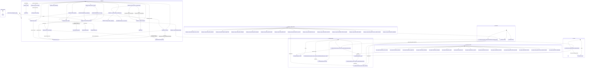

```mermaid
stateDiagram-v2 
    [*] --> JobQueue
    Driver.create_driver(queue_config) --> JobQueue
    JobQueueNode --> JobQueue.add_job(JobQueueNode)

    
    state JobQueue {
        [*] --> JobQueue.job_list: List[JobQueueNode]
        [*] --> JobQueue._differ: QueueDiffer()
            JobQueue._differ --> QueueDiffer
        [*] --> JobQueue.get_max_running(): get/set max running
            JobQueue.get_max_running() --> Driver.get_max_running(): get/set max running
        [*] --> JobQueue.is_active()
            JobQueue.is_active() --> JobQueue.job_list: loop over all jobs in list
            JobQueue.is_active() --> JobQueueNode.thread_status: return any ThreadStatus.READY|RUNNING|STOPPING
        [*] --> JobQueue.fetch_next_waiting()
            JobQueue.fetch_next_waiting() --> JobQueue.job_list: loop over all jobs in list
            JobQueue.fetch_next_waiting() --> JobQueueNode.thread_status: return first job with ThreadStatus.READY
        [*] --> JobQueue.add_job(JobQueueNode)
            JobQueue.add_job(JobQueueNode) --> JobQueue._add_job(JobQueueNode)
                JobQueue._add_job(JobQueueNode) --> C_JobQueue.job_queue_add_job_node(JobQueue,JobQueueNode)
            JobQueue.add_job(JobQueueNode) --> JobQueue.job_list: append job to list
            JobQueue.add_job(JobQueueNode) --> QueueDiffer.add_state(): queueindex from C_JobQueue._add_job()
        [*] --> JobQueue.stop_jobs()
            JobQueue.stop_jobs() --> JobQueue.job_list: loop over all jobs
            JobQueue.stop_jobs() --> JobQueueNode.stop(): for every job
        [*] --> JobQueue.launch_jobs()
            JobQueue.launch_jobs() --> JobQueue.fetch_next_waiting(): get next job
            JobQueue.launch_jobs() --> JobQueueNode.run()
        [*] --> JobQueue.execute_queue()
             JobQueue.execute_queue() --> JobQueue.is_active()        
             JobQueue.execute_queue() --> JobQueue.launch_jobs()        
             JobQueue.execute_queue() --> JobQueue.stop_jobs(): at end        
        [*] --> JobQueue._publish_changes()
            JobQueue._publish_changes() --> WebSocket
        [*] --> JobQueue._execution_loop_via_websockets()
            JobQueue._execution_loop_via_websockets() --> JobQueue.launch_jobs()
            JobQueue._execution_loop_via_websockets() --> JobQueue.changes_without_transition()
            JobQueue._execution_loop_via_websockets() --> JobQueue._publish_changes()
            JobQueue._execution_loop_via_websockets() --> QueueDiffer.transition_to_new_state()
        [*] --> JobQueue.execute_queue_via_websockets()
            JobQueue.execute_queue_via_websockets() --> JobQueue._publish_changes(): before _execution_loop_via_websockets
            JobQueue.execute_queue_via_websockets() --> JobQueue._execution_loop_via_websockets()
            JobQueue.execute_queue_via_websockets() --> JobQueue._publish_changes(): after _execution_loop_via_websockets
        [*] --> JobQueue.add_job_from_run_arg()
            JobQueue.add_job_from_run_arg() --> JobQueueNode(based_on_run_arg)
            JobQueueNode(based_on_run_arg) --> JobQueue.add_job(JobQueueNode)

        [*] --> JobQueue.add_realization()
            JobQueue.add_job_from_run_arg() --> JobQueueNode(based_on_realization)
            JobQueueNode(based_on_realization) --> JobQueue.add_job(JobQueueNode)

    }


    state C_JobQueue {
        [*] --> C_JobQueue.status
            C_JobQueue.status --> C_JobQueueStatus.job_queue_status_transition(): parameter in
        [*] --> C_JobQueue.driver
        [*] --> C_JobQueue.job_queue_add_job_node(JobQueue,JobQueueNode)
            C_JobQueue.job_queue_add_job_node(JobQueue,JobQueueNode) --> C_JobList.job_list_add_job(JobList,JobQueueNode)
            C_JobQueue.job_queue_add_job_node(JobQueue,JobQueueNode) --> C_JobQueueStatus.job_queue_status_transition()
            C_JobQueue.job_queue_add_job_node(JobQueue,JobQueueNode) --> C_JobQueueNode.job_queue_node_set_status(JobQueueNode,status):status=JOB_QUEUE_WAITING
    }

    state C_JobList {s
        [*] --> C_JobList.vec_jobs: vector<JobQueueNode>
        [*] --> C_JobList.job_list_add_job(JobList,JobQueueNode)
            C_JobList.job_list_add_job(JobList,JobQueueNode) --> C_JobQueueNode.job_queue_node_set_queue_index(JobQueueNode,queue_index)
            C_JobList.job_list_add_job(JobList,JobQueueNode) --> C_JobList.vec_jobs: push_back(JobQueueNode)

    }

    state C_JobQueueNode {
        [*] --> C_JobQueueNode.sim_start: time_t
        [*] --> C_JobQueueNode.job_status
            C_JobQueueNode.job_status --> C_JobQueueNode.job_queue_node_get_status(JobQueueNode)
        [*] --> C_JobQueueNode.queue_index
        [*] --> C_JobQueueNode.job_queue_node_set_queue_index(JobQueueNode,queue_index)
            C_JobQueueNode.job_queue_node_set_queue_index(JobQueueNode,queue_index) --> C_JobQueueNode.queue_index: set index
        [*] --> C_JobQueueNode.job_queue_node_get_status(JobQueueNode)
            C_JobQueueNode.job_queue_node_get_status(JobQueueNode) --> C_JobQueueStatus.job_queue_status_transition(): parameter in
        [*] --> C_JobQueueNode.job_queue_node_set_status(JobQueueNode,status)
            C_JobQueueNode.job_queue_node_set_status(JobQueueNode,status) --> C_JobQueueNode.job_status: set status
            C_JobQueueNode.job_queue_node_set_status(JobQueueNode,status) --> C_JobQueueNode.sim_start: set time to now

    }   

    state JobQueueNode {
        [*] --> Driver
    }

    state C_JobQueue_Status_Enums {
        [*] --> JobQueue_Status.JOB_QUEUE_NOT_ACTIVE
        [*] --> JobQueue_Status.JOB_QUEUE_WAITING
        [*] --> JobQueue_Status.JOB_QUEUE_SUBMITTED
        [*] --> JobQueue_Status.JOB_QUEUE_PENDING
        [*] --> JobQueue_Status.JOB_QUEUE_RUNNING
        [*] --> JobQueue_Status.JOB_QUEUE_DONE
        [*] --> JobQueue_Status.JOB_QUEUE_EXIT
        [*] --> JobQueue_Status.JOB_QUEUE_IS_KILLED
        [*] --> JobQueue_Status.JOB_QUEUE_DO_KILL
        [*] --> JobQueue_Status.JOB_QUEUE_SUCCESS
        [*] --> JobQueue_Status.JOB_QUEUE_STATUS_FAILURE
        [*] --> JobQueue_Status.JOB_QUEUE_FAILED
        [*] --> JobQueue_Status.JOB_QUEUE_DO_KILL_NODE_FAILURE
        [*] --> JobQueue_Status.JOB_QUEUE_UNKNOWN
    }
    C_JobQueue_Status_Enums --> C_JobQueue.status
    C_JobQueue_Status_Enums --> C_JobQueueStatus.job_queue_status_transition(): parameter in

    state C_Job_Status_Enums {
        [*] --> Job_Status.JOB_QUEUE_NOT_ACTIVE
        [*] --> Job_Status.JOB_QUEUE_WAITING
        [*] --> Job_Status.JOB_QUEUE_SUBMITTED
        [*] --> Job_Status.JOB_QUEUE_PENDING
        [*] --> Job_Status.JOB_QUEUE_RUNNING
        [*] --> Job_Status.JOB_QUEUE_DONE
        [*] --> Job_Status.JOB_QUEUE_EXIT
        [*] --> Job_Status.JOB_QUEUE_IS_KILLED
        [*] --> Job_Status.JOB_QUEUE_DO_KILL
        [*] --> Job_Status.JOB_QUEUE_SUCCESS
        [*] --> Job_Status.JOB_QUEUE_STATUS_FAILURE
        [*] --> Job_Status.JOB_QUEUE_FAILED
        [*] --> Job_Status.JOB_QUEUE_DO_KILL_NODE_FAILURE
        [*] --> Job_Status.JOB_QUEUE_UNKNOWN
    }
        C_Job_Status_Enums --> C_JobQueueNode.job_status
    
```